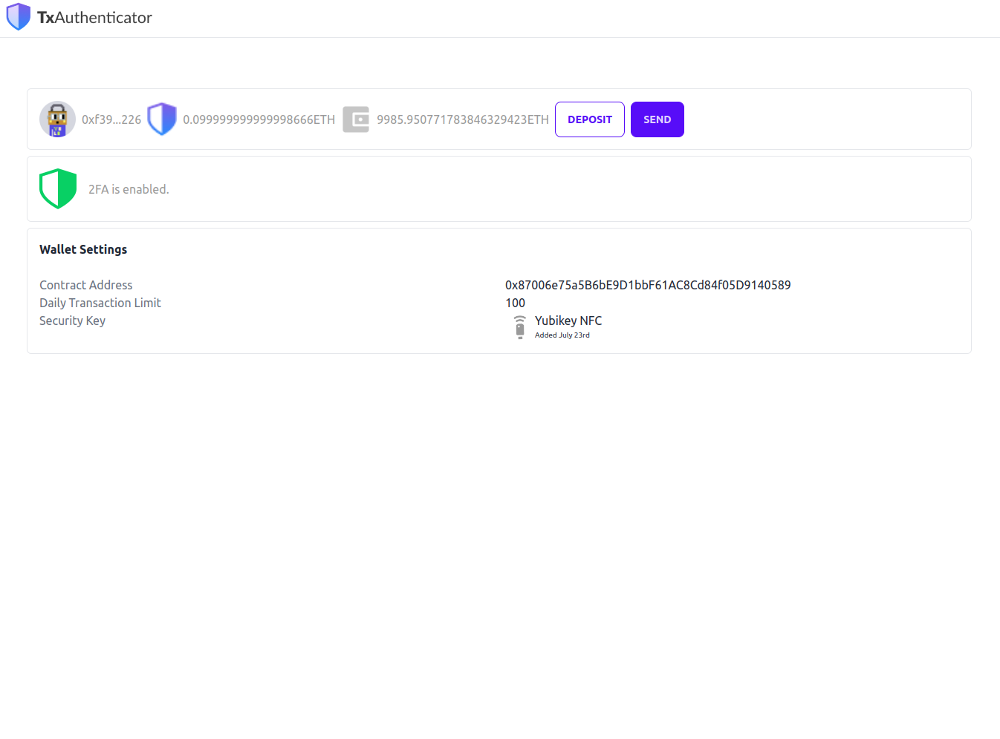

# TxAuthenticator

## TLDR

TxAuthenticator brings _2FA to Ethereum wallets_! Use your YubiKey as a physical, 2FA option to protect wallet users.

## Rationale

In 2022, cyber criminals stole a staggering $3.8 billion in cryptocurrency (source). Many of these thefts can be traced back to phishing attacks and scams involving:

- Stealing a user's private key for their self-custodied Ethereum wallet; or,
- Tricking users into authorizing a malicious contract from their self-custodied Ethereum wallet.

For self-custodied web and mobile-based Ethereum wallets, 2FA remains notably absent, leaving assets vulnerable to complete loss from hacks and private key exposure.

## How to run

Run `cd backend && yarn && cd ../txauth && yarn && cd ../frontend && yarn && yarn start`

In `backend` run `node index.js`. Backend is only there as the steps to deploy the contracts are too time consuming for a hackathon, this could be all done in the frontend if we had more time.

## Shoutout!

Shoutout to Alembic for their great work on bringing Webauthn to Ethereum! Let's hope Ethereum will add the right precompiles to make this cheap and easy! Original repo can be found [here](https://github.com/alembic-tech/P256-verify-signature)
